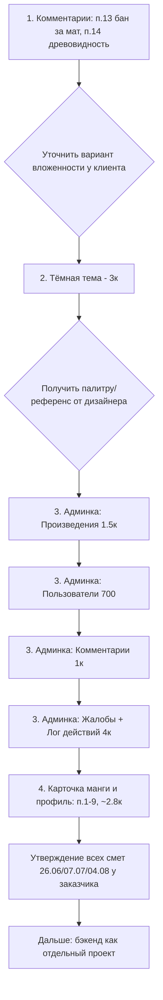

# Plan.md — план доработок Panelia

> Составлено на основе переписки в рабочем чате (Telegram, 19 мая — 7 августа 2026) между
> заказчиком (Сергей, Иван В.) и разработчиком (Пулат Зафаров), сверено с текущим состоянием
> кода в репозитории по состоянию на 07.08.2026.
>
> Статус пунктов проверен по коду, а не только по словам в чате — там, где это возможно.

---

## 1. Текущий статус проекта

Проект — **фронтенд-прототип на моковых данных**, бэкенд не подключён и не начат.
Изначально сделан по Figma-макету, затем на объект наросло много доп. функционала
(полное ТЗ пришло 19.06, уже после первой сдачи главной/каталога/карточки/ридера/профиля).

Действующая договорённость по приоритету работ (зафиксирована 04–06.08.2026):

1. **Сначала** — доделать комментарии (пункты 10–14 из списка ниже)
2. **Затем** — тёмная тема (согласована, 3к, ждёт начала)
3. **Затем** — админ-панель (добавлена в очередь заказчиком 06.08)
4. **Остальное** — все прочие допы (карточка манги, профиль, отдельные вкладки в админке) —
   после перечисленного, порядок пока не зафиксирован

Деньги: часть смет (26.06 и 07.07) на момент последнего сообщения в чате (07.08) **формально
не утверждены заказчиком**, хотя разработчик уже часть из них сделал. Это открытый
организационный вопрос, не блокирующий текущую техническую работу, но требующий решения
до выставления финального счёта.

---

## 2. Этап 1 — Комментарии (выполнен на 07.08.2026 в рамках выбранного варианта)

Источник: доп. пункты 10–14 из прайса Пулата от 04.08.2026, подтверждено отчётом 07.08.2026.

| # | Пункт | Цена | Статус |
|---|-------|------|--------|
| 10 | Спойлер в комментариях | 300 | ✅ Готово (`RichTextEditor.tsx` — `SpoilerIcon`, `handleSpoilerClick`) |
| 11 | Полноценный rich-text редактор (жирность, курсив, цитата, зачёркивание, спойлер, эмодзи) | 800 | ✅ Готово (`components/RichTextEditor.tsx`, 435 строк) |
| 12 | Фильтрация комментариев (новые / популярные) | 300 | ✅ Готово (`commentSort` в `manga/[id]/read/page.tsx`) |
| 13 | Бан за нецензурные слова в комментариях (админка) | 300 | ✅ Готово — `admin/comments/page.tsx`: автометка по словарю-заглушке, вся строка с подозрительным комментарием подсвечивается светло-красным (`admin-table__row--flagged`, тот же #fdecea, что и в `admin-badge--banned`) + бейдж «Нецензурно», кнопка бана в действиях строки + модалка подтверждения |
| 14 | Древовидные комментарии (полноценная вложенность) | 500 | ✅ Переделано на настоящую визуальную вложенность (вариант 2): ответы рендерятся вложенными под родительским комментарием с отступом, вертикальной соединительной линией и уменьшенным аватаром (по аналогии с референсом от заказчика). Ответы на любой комментарий внутри ветки всегда прикрепляются к корневому комментарию (один уровень вложенности, как на скриншоте-референсе). Реализовано через общий рекурсивный компонент `CommentBlock` (чтобы не дублировать разметку корня/ответа) в обоих местах: `manga/[id]/page.tsx` и `manga/[id]/read/page.tsx`. Отступы/размеры аватара во всех брейкпоинтах взяты из уже существующих размеров сайта (52/46/40/32px), вертикальная линия — `var(--color-gray-light)`. |

**Итоговое решение по п.14**: после фидбэка заказчика (со скриншотом-референсом) первоначальный «безопасный» вариант 1 (ссылка без визуальной вложенности) был заменён на **вариант 2** — настоящие вложенные ответы с отступами. Адаптив проверен на всех брейкпоинтах сайта (1024/768/540/400/340px), включая особый grid-режим комментариев на ≤540px в `manga/[id]/page.tsx`.

Глубина вложенности ограничена одним уровнем намеренно (как и на референсном скриншоте): ответ на ответ внутри ветки добавляется в тот же список ответов, без дальнейшего углубления отступов. Если понадобится бесконечная вложенность — это отдельная доработка.
2. Реальные ветки на один уровень вложенности, с плашкой на мобильном и сворачиванием — цена по факту объёма (Пулат оценивал этот пункт в 500 в итоговом прайсе 04.08, видимо, взял вариант 2)
3. Оставить как есть

→ **Нужно уточнить у заказчика, какой вариант согласован**, прежде чем делать пункт 14 —
иначе есть риск повторной переделки (в чате это уже 6-я по счёту правка комментариев).

---

## 3. Этап 2 — Тёмная тема (согласовано, следующий по приоритету)

- Согласована 26.06, цена **3 000 ₽**, срок ~3–4 дня по 6 ключевым страницам
  (главная, каталог, карточка манги, ридер, профиль (6 табов), админка (3 таба)).
- Готовность на 07.08: **0%** — в коде есть только кнопка-переключатель темы в `Header.tsx`
  (`btn-theme`), она ничего не делает, логики переключения/CSS-переменных для тёмной палитры
  в `globals.css` нет.
- Требуется до старта: пример тёмной палитры/оттенков от дизайнера — Пулат прямо просил
  это 02.07, чтобы не переделывать по многу раз.

**Рекомендация**: до начала попросить у заказчика конкретные тёмные оттенки (Figma-макет
или референс), иначе есть риск такой же серии правок, как с комментариями.

---

## 4. Этап 3 — Админ-панель (добавлена в очередь 06.08)

Источник: прайс от 04.08.2026, аудит "Произведения / Пользователи / Комментарии" — только вёрстка, без бэкенда.

### Произведения (`/admin/works`) — 1.5к, 1 день
| Пункт | Цена | Статус |
|---|---|---|
| Сортировка полей в таблице | 400 | ⏳ Не начато (в `admin/works/page.tsx` сортировки нет) |
| Баг: редактирование выглядит как создание с пустыми полями | бесплатно (баг) | ⏳ Не проверено |
| Восстановление удалённых записей с таймером | 800 | ⏳ Не начато |
| Поиск по автору/издателю + сортировка | 100 | ⏳ Не начато |
| Исключительная сортировка "только" | 200 | ⏳ Не начато |
| Кнопка «Добавить главу» рядом с произведением в списке (переход на форму) | бесплатно | ⏳ Не начато |

### Пользователи (`/admin/users`) — 700, 1 день
| Пункт | Цена | Статус |
|---|---|---|
| Сортировка пользователей | 400 | ⏳ Не начато |
| Имя пользователя как кликабельная ссылка на профиль | 100 | ⏳ Не начато |
| Текстовое поле причины при бане/ограничении | 200 | ⏳ Не начато (в коде `admin/users/page.tsx` поля причины нет) |

### Комментарии (`/admin/comments`) — 1к, 1 день
| Пункт | Цена | Статус |
|---|---|---|
| Сортировка комментариев | 400 | ⏳ Не начато |
| Бан/ограничение пользователя прямо из списка комментариев (с причиной) | 500 | ⏳ Не начато |
| `placeholder` «Автор» → «Пользователь» | 100 | ⏳ Не начато |

### Отдельно — 4к, 3 дня
| Пункт | Цена | Статус |
|---|---|---|
| Вкладка «Жалобы» (сортировка, удаление, поиск) | 2к | ⏳ Не начато — сейчас `ReportModal.tsx` только отправляет жалобу на фронте, в админке раздела жалоб нет |
| Вкладка «Недавние действия» (лог: регистрации, новые главы, жалобы, ограничения, удаления) | 2к | ⏳ Не начато |

**Итого по этапу**: 7.2к / ~5 дней суммарно на всю админку.

---

## 5. Этап 4 — Остальные допы по карточке манги и профилю (после этапов 1–3)

Источник: тот же прайс от 04.08, пункты 1–9 (страница манги/профиля), согласованы по цене,
но выполняются последними по приоритету.

| # | Пункт | Цена | Статус |
|---|-------|------|--------|
| 1 | Удалить блок «Новые главы» со страницы манги | 200 | ⏳ Не проверено |
| 2 | Кнопку «Написать отзыв» перенести в таб отзывов | 300 | ⏳ Не проверено |
| 3 | Оценку (цифры) перенести на обложку | 300 | ⏳ Не начато |
| 4 | Звёздный рейтинг в отдельную модалку/кнопку | 400 | ✅ Частично — `ReviewModal.tsx` уже выделяет оценку отдельно от отзыва |
| 5 | Логин и почта в настройках профиля | 300 | ⏳ Не начато — в `profile/page.tsx` таб «Настройки» есть только смена пароля |
| 6 | Быстрый поиск по жанрам (в поиске сверху) + жанры в админке | 500 | ⚠️ Возможно вычеркнут заказчиком 04.08 (сообщение неоднозначно — **нужно уточнить**) |
| 7 | Возрастное ограничение на странице манги | 300 | ⏳ Не начато |
| 8 | Статусы (анонс/выходит/приостановлено/закрыто) с датами на странице манги + доредактирование в админке | 300 | ⚠️ Частично — статус есть в форме добавления (`admin/works/add`), на самой странице манги дат/статуса нет |
| 9 | Автор и название студии на странице манги | 200 | ⏳ Не начато |

Отдельно обсуждалась **страница/модалка с графиком оценок** (по примеру IMDb) — Пулат в
итоговом прайсе 04.08 её не включил, похоже, пункт снят с обсуждения. **Нужно подтвердить
у заказчика**, что этот пункт больше не актуален.

**Итого по этапу**: ~2.8к / уточнить срок.

---

## 6. Не входит в текущий объём (бэкенд и инфраструктура)

Требует отдельного проекта/этапа, в текущих сметах не участвует:

- REST/GraphQL API и база данных (манга, пользователи, главы, комментарии, закладки)
- Реальная авторизация (JWT / OAuth-провайдеры сейчас только вёрстка кнопок)
- Хранилище изображений (S3 или аналог)
- Реальная фильтрация/поиск/сортировка (сейчас работают только визуально на моках)
- Push/email-уведомления (в т.ч. нужны, если делать древовидные комментарии по-нормальному)
- SEO (динамические meta-теги)

---

## 7. Рекомендуемый порядок работ (сводка)

### Немедленные действия перед стартом каждого этапа
1. **Перед п.14 (древовидные комментарии)** — получить письменное решение по одному из
   3 вариантов реализации.
2. **Перед тёмной темой** — получить конкретную палитру/референс от дизайнера.
3. **Перед этапом 4** — уточнить, актуальны ли ещё пункт 6 (быстрый поиск по жанрам) и
   страница/график оценок (похоже, оба сняты 04.08, но это неочевидно из текста чата).
4. **В целом** — добиться формального утверждения смет 26.06, 07.07 и 04.08, чтобы не
   работать «в долг» и не пришлось пересчитывать объём задним числом.

---

*Документ отражает состояние на 07.08.2026. Обновлять по мере выполнения пунктов и
появления новых договорённостей в чате.*
